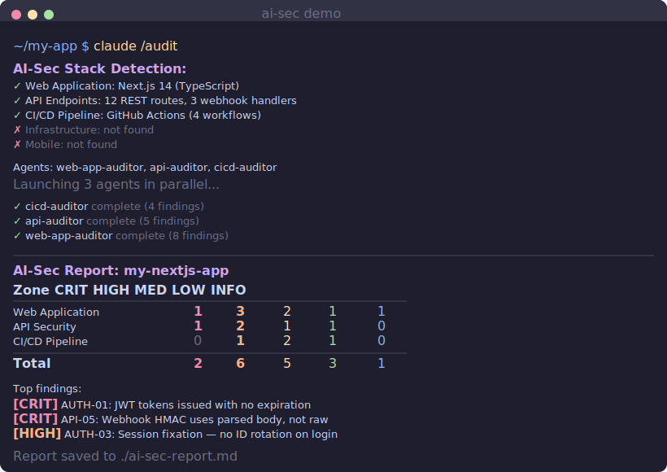

<div align="center">

[](LICENSE)
[](https://github.com/sergey-ko/ai-sec/stargazers)
[](https://claude.ai)
[](https://owasp.org)

# AI-Sec

### Security audit that reads your code like a senior reviewer

**One command. Zero config. Finds what scanners can't.**

AI-Sec uses Claude to reason about your entire codebase — auth flows, business logic, infrastructure — and audit it against OWASP ASVS, MASVS, CIS benchmarks, and CI/CD Top 10. It catches the things regex will never find.

</div>

---

<div align="center">
  
</div>

---

## Quick Start

### Option 1: Plugin (recommended)

```bash
/install sergey-ko/ai-sec
```

Then from your project:

```bash
/audit
```

### Option 2: Clone

```bash
git clone https://github.com/sergey-ko/ai-sec.git
```

Then in Claude Code, from your project directory:

```bash
/audit
```

That's it. AI-Sec auto-detects your stack and runs the relevant checks.

## What It Finds (That Scanners Miss)

| Category | Example | Why Scanners Miss It |
|----------|---------|---------------------|
| **Broken Auth** | JWT tokens with 30-day expiry, no rotation | Requires understanding the auth flow |
| **IDOR** | `/api/users/:id` returns any user's data | Can't reason about authorization logic |
| **Business Logic** | Negative prices bypass validation | Requires understanding intent |
| **Webhook Forgery** | HMAC uses parsed body, not raw bytes | Requires tracing data through middleware |
| **CI/CD Supply Chain** | Actions pinned to mutable tags, not SHA | Requires understanding CI/CD threat model |
| **Infra Drift** | EKS API server publicly accessible | Requires reading Terraform + cloud context |

## AI-Sec vs. Traditional Scanners

| Capability | AI-Sec | Snyk | Semgrep | CodeQL |
|:-----------|:------:|:----:|:-------:|:------:|
| Understands auth flows | :white_check_mark: | :x: | :x: | :warning: |
| Detects business logic flaws | :white_check_mark: | :x: | :x: | :x: |
| IDOR detection | :white_check_mark: | :x: | :warning: | :warning: |
| Webhook forgery | :white_check_mark: | :x: | :x: | :x: |
| CI/CD supply chain | :white_check_mark: | :white_check_mark: | :warning: | :x: |
| Infrastructure drift | :white_check_mark: | :x: | :x: | :x: |
| Framework compliance matrix | :white_check_mark: | :x: | :x: | :x: |
| Zero config | :white_check_mark: | :x: | :x: | :x: |
| Free & open source | :white_check_mark: | Freemium | :white_check_mark: | :white_check_mark: |

**Why the difference?** Traditional scanners pattern-match against known CVEs and syntax rules. AI-Sec reads your code the way a security engineer does — understanding what it's *supposed* to do, then finding where it doesn't.

## How It Works

```
/audit
  │
  ├─ 1. DETECT     What's in this repo?
  │                 → Next.js + GitHub Actions + Terraform + Dockerfile
  │
  ├─ 2. DISPATCH   Run specialized agents in parallel
  │                 ┌─────────────────┐  ┌─────────────────┐  ┌─────────────────┐
  │                 │ web-app-auditor │  │  cicd-auditor   │  │ infra-auditor   │
  │                 │  OWASP ASVS L2  │  │  CI/CD Top 10   │  │ CIS Benchmarks  │
  │                 └────────┬────────┘  └────────┬────────┘  └────────┬────────┘
  │                          │                    │                    │
  ├─ 3. AUDIT      Each agent: Enumerate → Check → Test → Report
  │                          │                    │                    │
  │                          ▼                    ▼                    ▼
  └─ 4. REPORT     ai-sec-report.md
                    ├── 12 findings (2 Critical, 4 High, 3 Medium, 2 Low, 1 Info)
                    └── ASVS compliance matrix (47 checks: 31 PASS, 12 FAIL, 4 N/A)
```

## Agents

Five specialized auditors. Each follows a 4-phase process: **Enumerate → Check → Test → Report.**

| Agent | Framework | Scope |
|-------|-----------|-------|
| `web-app-auditor` | OWASP ASVS v4.0.3 L2 | Auth, sessions, access control, input validation, config |
| `api-auditor` | ASVS V13 + V2.10 | REST/GraphQL, webhooks, rate limiting, schema validation |
| `cicd-auditor` | OWASP CI/CD Top 10 | GitHub Actions, Docker, deps, secrets, branch protection |
| `infra-auditor` | CIS Benchmarks | K8s, AWS/GCP/Azure, Terraform, IAM, networking |
| `mobile-auditor` | OWASP MASVS v2.1 L1 | Storage, crypto, auth, network, platform security |

Run individually:
```
Claude, run the web-app-auditor agent on this codebase
```

## Finding Format

Every finding includes severity, CVSS, framework reference, evidence, and actionable fix:

```markdown
### [HIGH] AUTH-03: JWT tokens never expire

**CVSS:** 7.5 (AV:N/AC:L/PR:N/UI:N/S:U/C:H/I:N/A:N)
**Framework:** ASVS V3.5.3
**Component:** src/auth/jwt.service.ts:42

JWT tokens issued with no expiration claim. A stolen token grants permanent access.

**Evidence:**
const token = jwt.sign({ userId }, SECRET);
// No expiresIn — token never expires

**Recommendation:**
const token = jwt.sign({ userId }, SECRET, { expiresIn: '15m' });
// Add refresh token rotation for long-lived sessions
```

## Track Findings Across Runs

AI-Sec supports a `findings-registry.yaml` to track findings across audit cycles:

```bash
/track              # Initialize or update the findings registry
```

The registry tracks each finding's lifecycle — when it was first found, current status, and automated verification patterns that confirm whether a fix has been applied. No more re-triaging the same findings every sprint.

See [`methodology/findings-registry-template.yaml`](methodology/findings-registry-template.yaml) for the schema.

## Battle-Tested

> **87+ findings across 5 security zones** on a VARA-regulated cryptocurrency exchange in production — a platform handling real money under regulatory oversight.
>
> This is the same methodology, packaged as an open-source tool.

The frameworks aren't theoretical. Every checklist in [`methodology/`](methodology/) comes from real audits on real systems — auth flows protecting real money, CI/CD pipelines deploying to regulated infrastructure, Kubernetes clusters running production workloads.

## What AI-Sec Is NOT

- **Not a replacement for pentesting.** White-box code review only — it doesn't test running applications.
- **Not a SAST scanner.** No regex patterns or CVE matching. It reasons about architecture.
- **Not perfect.** Catches ~60-70% of what a senior security consultant finds. The gap is why consulting exists.

## Want More?

For expert-reviewed audits, compliance-ready reports, and continuous monitoring — visit [ai-sec.pro](https://ai-sec.pro).

## Contributing

Contributions welcome. The best ways to help:

- **Run it on your project** and report false positives/negatives
- **Add methodology checklists** for frameworks we don't cover yet
- **Improve agent prompts** — the agents live in `.claude/agents/`
- **Share your audit reports** (redacted) so we can benchmark accuracy

See the [`methodology/`](methodology/) folder for the audit frameworks.

## License

MIT — use it, fork it, audit everything.
